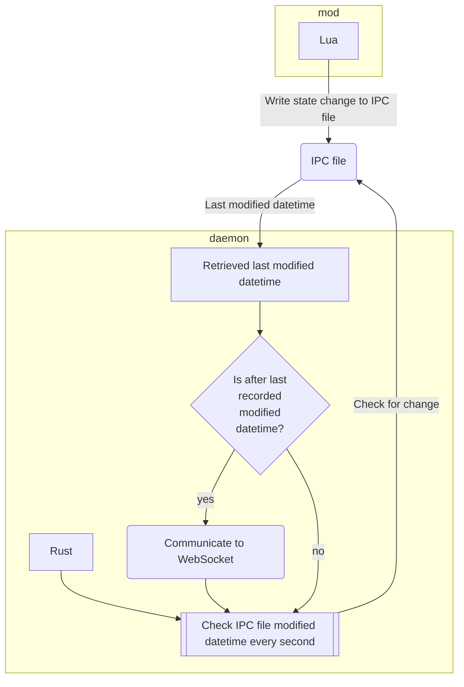

## Trying to get `ffi` and `require()` to work somehow
`require` might not actually be scuffed if this error can be resolved?
`loadfile` throws the same error

Latest error Loading with `dofile`
```
06:04:58 PM FATAL ERROR:  (C:\projects\payday2-superblt\src\InitiateState.cpp:320) mods/HeistersHaptics/mod.lua:1: attempt to call global 'loadfile' (a nil value)
stack traceback:
	mods/HeistersHaptics/mod.lua:1: in main chunk
	[C]: in function 'dofile'
	mods/base/base.lua:169: in function 'RunHookFile'
	mods/base/base.lua:157: in function 'RunHookTable'
	mods/base/base.lua:189: in function 'OrigRequire'
	mods/BeardLib/Core.lua:406: in function 'require'
	[string "lib/setups/setup.lua"]:133: in main chunk
	[C]: in function 'require'
	mods/base/base.lua:188: in function 'OrigRequire'
	mods/BeardLib/Core.lua:406: in function 'require'
	[string "lib/setups/menusetup.lua"]:1: in main chunk
	[C]: in function 'require'
	mods/base/base.lua:188: in function 'OrigRequire'
	mods/BeardLib/Core.lua:406: in function 'require'
	[string "lib/entry.lua"]:13: in main chunk
	[C]: in function 'require'
	mods/base/base.lua:188: in function 'OrigRequire'
	mods/BeardLib/Core.lua:406: in function 'require'
	[string "core/lib/coreentry.lua"]:19: in main chunk
```

Issue is probably from the `require` for `ffi` in `pollnet`
Ask Siri if she knows if I can get a copy of `ffi.lua` somewhere?

`BeardLib` seems to be causing cancer here but I haven't tried turning it off
Technically if `BeardLib` stops trying to resolve the require `OrigRequire` from `SuperBLT` should run the mod just fine
This happens because `SuperBLT` is checking for available Hooks on the pass path which seems to trigger some `BeardLib` registered Hook

---

### Full documented Stack trace

[`lib/setups/setup.lua:133`](https://github.com/steam-test1/Payday-2-LuaJIT-Complete/blob/master/lib/setups/setup.lua#L133C1-L133C37)
```lua
require("lib/utils/dev/api/TestAPI")
```
[lib/utils/dev/api/TestAPI](https://github.com/steam-test1/Payday-2-LuaJIT-Complete/blob/master/lib/utils/dev/api/testapi.lua) ❗❗❗Not checked yet

[`lib/setups/menusetup.lua:1`](https://github.com/steam-test1/Payday-2-LuaJIT-Complete/blob/master/lib/setups/menusetup.lua#L1C1-L1C28)
```lua
require("lib/setups/Setup")
```

[`lib/entry.lua:13`](https://github.com/steam-test1/Payday-2-LuaJIT-Complete/blob/master/lib/entry.lua#L13)
```lua
require("lib/utils/Version")

local selected_setup = nil

if Global.load_level then
	selected_setup = require("lib/setups/NetworkGameSetup")
elseif Global.load_start_menu then
	selected_setup = require("lib/setups/MenuSetup")
elseif Application:editor() then
	selected_setup = require("lib/setups/EditorSetup")
else
	selected_setup = require("lib/setups/MenuSetup")
end    --:13
```

[`core/lib/coreentry.lua:19`](https://github.com/AzureeDev/payday-2-luajit/blob/master/pd2-lua/core/lib/coreentry.lua)
```lua
-- this is the entire file... line 19 doesn't exist 
-- although refers to lib/entry.lua as per the stack trace (count checks out)
require("core/lib/system/CoreSystem")

if table.contains(Application:argv(), "-slave") then
	require("core/lib/setups/CoreSlaveSetup")
else
	require("lib/Entry")
end
```

If the line count is continually counted throughout files the culprit may be either one of the following statements

[`lib/utils/dev/testapi.lua`](https://github.com/steam-test1/Payday-2-LuaJIT-Complete/blob/master/lib/utils/dev/api/testapi.lua#L131)
```lua
function TestAPIHelper.queue_call(category_and_or_func_name, response_string, args)
	local cat_func = string.split(category_and_or_func_name, "%.")
	local category = cat_func[1]
	local func_name = cat_func[2]
	Global.test_api.queued_calls = Global.test_api.queued_calls or {}
	
	-- starting from here
	assert(
		TestAPI[category], 
		string.format("Missing category in TestAPI: %s", 
		tostring(category)))
	assert(
		TestAPI[category][func_name], 
		string.format("Missing function in TestAPI: %s", 
		tostring(func_name)))
	table.insert(Global.test_api.queued_calls, {
		category = category,
		func_name = func_name,
		response_string = response_string,
		args = args
	})
end
```

It seems that loading things via `dofile()` DOES work but returning an object doesn't
It's possible to define one globally

**Sadly this doesn't solve the `ffi` issue**

---

#### Get an external `ffi` library and use it via `dofile()`, etc.

Options:
- [luaffifb](https://github.com/facebookarchive/luaffifb)
- [luaffi](https://github.com/jmckaskill/luaffi)
- [cffi-lua](https://github.com/q66/cffi-lua)

Building and using these in linux, outside of the Payday 2 environment, worked without issues.
Building on windows I've only succeeded in doing for `cffi-lua`, however loading the `.dll` fails with a number of different errors depending on the load method used for the attempt.
##### Types of errors seen with different attempts to load a library (basically same for all of them)

###### `dofile(ModPath .. "cffi.dll")`
```
09:11:48 AM FATAL ERROR:  (C:\projects\payday2-superblt\src\InitiateState.cpp:300) mods/HeistersHaptics/cffi.dll:1: '=' expected
```

###### `package.loadlib(ModPath .. "cffi.dll", "luaopen_cffi")`
```
08:36:16 AM FATAL ERROR:  (C:\projects\payday2-superblt\src\InitiateState.cpp:320) mods/HeistersHaptics/mod.lua:6: %1 is not a valid Win32 application.
```

###### `BeardLib:OrigRequire(ModPath .. "cffi")`
```
09:35:07 AM FATAL ERROR:  (C:\projects\payday2-superblt\src\InitiateState.cpp:320) mods/base/base.lua:184: attempt to call method 'lower' (a nil value)
stack traceback:
	mods/base/base.lua:184: in function 'OrigRequire'
	mods/HeistersHaptics/mod.lua:8: in main chunk
	[C]: in function 'dofile'
	mods/base/base.lua:169: in function 'RunHookFile'
	mods/base/base.lua:157: in function 'RunHookTable'
	mods/base/base.lua:189: in function 'OrigRequire'
	mods/BeardLib/Core.lua:406: in function 'require'
	[string "lib/setups/setup.lua"]:133: in main chunk
	[C]: in function 'require'
	mods/base/base.lua:188: in function 'OrigRequire'
	mods/BeardLib/Core.lua:406: in function 'require'
	[string "lib/setups/menusetup.lua"]:1: in main chunk
	[C]: in function 'require'
	mods/base/base.lua:188: in function 'OrigRequire'
	mods/BeardLib/Core.lua:406: in function 'require'
	[string "lib/entry.lua"]:13: in main chunk
	[C]: in function 'require'
	mods/base/base.lua:188: in function 'OrigRequire'
	mods/BeardLib/Core.lua:406: in function 'require'
	[string "core/lib/coreentry.lua"]:19: in main chunk
```

This error tells me that it still runs through BLT's overridden require function, as it fails on called `path:lower()` in the override function.

```lua
-- Override require function to run hooks
_G.require = function(...)
    local args = { ... }
    local path = args[1]    --:184
    local path_lower = path:lower()
```

This occurs because `path` in this case is actually a function.
Calling this function fails in `BeardLib`'s `ModCore:GetSettings()`

```lua
function ModCore:GetSettings()
    return BeardLib.Options:GetValue("ModSettings")[self.ModPath] or {}
end
```

###### `require("cffi")` or `BLT:require("cffi")`
Both crash the game on launch without an error log present. Might try later with a later running hook.

---
## I give up
Loading `.so` and `.o` files works without issue via `dofile()` or `package.loadlib()`
~~Having a compiled `ffi` library from one of the various other sources doesn't come with Win32 support which disqualifies it for the Payday2 modding purpose.~~
This is wrong apparently as other libs claim Win x86 support.

Building `cffi-lua` on windows with a windows built `LuaJIT 2.1.0-beta2` has actually produced results, albeit not functional ones.

Turns out Payday 2 does **NOT** use `LuaJIT 2.1.0-beta2` unlike claimed online.
The actual version used is `LuaJIT 2.1.0-beta3`

```lua
BLT:Log(0, jit.version)
-- LuaJIT 2.1.0-beta3
```

I have cancer it's 2:30am and I'm going to go to sleep for now and retry all of this with 
`LuaJIT 2.1.0-beta3` tomorrow.

Rebuilding with `LuaJIT 2.1.0-beta3` did not work either. It still isn't detected as a proper Win32 application

It doesn't seem possible in a `SuperBLT` context to do this.
I will switch to Siri's proposed approach in the readme of [Heisters-Haptics](https://github.com/Siri-chan/Heisters-Haptics)and leave this alone for now.

```
NOTE: This code currently not work. This is mostly because BLT has issues calling require (believe me I've tried), and can't use the FFI library.
Here's my solution (that is 100% guaranteed to work im sure):

BLT does have (at least functioning enough to open `calc.exe`) support for `io.popen()`. This means - we can open a second program with dynamic information.

Here's the plan:
`haptic_serve.exe`: A program that runs as a daemon that is launched during `HapticsCore:init()`, and only gets closed by the user. This actually holds the connection with the Buttplug Websocket.
`haptic_ctl.exe`: A program that is run whenever vibration strength updates need to be issued, with arguments that inform it of how to alter the vibrations.
                    This then communicates (through a named pipe or some other IPC method we'll figure it out later) with `haptic_serve.exe`


Alternatively, this could be done with a python script or something for system compatability - I'll need to think on this for a bit.
```

---

## Separate daemon and client

#### Software stack
Lua will obviously have to be used for the mod side of things, exact integration with `SuperBLT` or `BeardLib` I will look at later.

The Daemon will be written in rust. It will handle WebSocket communication with the [Buttplug server](https://intiface.com/) either via the [Buttplug crate](https://crates.io/crates/buttplug) which uses [tungstenite-rs](https://github.com/snapview/tungstenite-rs) or alternatively I'll write my own solution using [fasterwebsockets](https://github.com/denoland/fastwebsockets) which is more performant for the type of data we'll send here.
#### Communication
Lua's IPC capabilities are kind of horrendous without external library support.
While on UNIX systems I could probably run `os.execute('mkfifo')` or something of the sort, this would do nothing at all on Windows systems. Windows [does have pipes](https://learn.microsoft.com/en-us/windows/win32/ipc/pipes) but the way they work is very different from UNIX pipes and would require a lot of weird code if communication is at all possible from this specific Lua context.

Considering `io` is available in a `SuperBLT` context, the only reasonable solution ~~excluding memory mapped files~~ is to read/write to a text file in the mod directory.

###### Possible approach
It would be possible to read the [last modified datetime](https://doc.rust-lang.org/std/fs/struct.Metadata.html#method.modified) of the text file in rust. Run this every second since updates won't appear often and only if the last modified date is different than the last modified datetime in cache, will rust read out the file and communicate the content to the WebSocket.



Seems to be the most reasonable approach for now and I'll keep working with this for the moment.

#### Running exe files from the mod side

Obviously I'll have to run the daemon from the mod and not have users start it by hand whenever they start Payday 2, since that would be kind of horrible.

I managed with some difficulty to run an exe from the `lua` mod without blocking the Payday 2 process until the end of execution. However I need some kind of Hook to close the process again since Payday 2 won't fully exit without closing it. Running `coroutine.stop()` might work if I can hook it into a sort of `exit hook`?

I want to pass the file path for the IPC file as a command line argument to the daemon.
This works although I had some issues with start, since start apparently takes the [first argument starting with quotes to set the window title](https://learn.microsoft.com/en-us/windows-server/administration/windows-commands/start).

This is a bit ugly but works for purpose. It does open a console window but that's something I'll try to circumvent later. Adding `/C` to start does NOT work.

```lua
local cdCommand = assert(io.popen('cd', 'r'))
local absPath = cdCommand:read('*all'):gsub("[\n\r]", "")
cdCommand:close()

local currentPath = absPath .. [[\]] .. ModPath:gsub("/", [[\]])
local daemonExecutablePath = [["]] .. currentPath .. [[heisters-haptics-communicator.exe" "]] .. currentPath .. [["]]

local detachedDaemon = coroutine.create(function()
    os.execute([[start "" ]] .. daemonExecutablePath)
end)

coroutine.resume(detachedDaemon)
```

Time to get to the real meat of the task.
#### Let the daemon detect file changes and react to them
So the idea of having to check every second is nice and all but what if I could just asynchronously watch for file changes and react to them... well [notify](https://github.com/notify-rs/notify) exists so that seems like a reasonable approach to try before anything else.

```rust
mod ipc_mod;
use std::{env, path::Path};
use ipc_mod::async_watch;

fn main() -> anyhow::Result<()> {
    let args: Vec<String> = env::args().collect();
    
    futures::executor::block_on(async {
        if let Err(e) = async_watch(Path::new(&args[1])).await {
	        println!("error: {:?}", e)
        }
	});
	
	Ok(())
}
``` 

Quick and dirty implementation to read out the first argument passed to the executable and use it as a path to check for changes for (actual `async_watch` implementation is in a different file).
Tried it with the log file that `SuperBLT` creates and it seems to work just fine.

```
changed: Event { kind: Modify(Any), paths: ["C:\\Program Files (x86)\\Steam\\steamapps\\common\\PAYDAY 2\\mods\\logs\\2024_05_01_log.txt"], attr:tracker: None, attr:flag: None, attr:info: None, attr:source: None }
```

Where the path to log was passed as an argument, just like I did in the Lua example in the previous section. 

##### IPC-File content format
I'm not quite sure what format the actual messages in the IPC file should have. It's possible for them to just be a simple `+x` `-x` format for the vibration intensity, however I'm not sure if that'll suffice. For now I've set up JSON parsing from the IPC file, along with ignoring any modes are than `modified` because I don't want to accidentally capture the creation (or manual use deletion) of it.

Failing to read the file or the JSON values out of it is just ignored with an error log at the moment but it seems to be the most reasonable way to handle those issues.
`"Could not read content of IPC file. Ignoring last command..."`

I'll discuss the actual format of the message with Siri, she has some experience with this after all.

##### Possible new Angle found
While talking to Siri I remembered that Lua **can** load in `.dll` files written in C that have the appropriate Lua bindings and export a `luaopen_packagename`.
Surely those bindings should exist for rust too right? [They do.](https://github.com/mlua-rs/mlua)
This is actually great news since it could let me circumvent the entire "running an exe as a separate process and communicating with it via IPC file" thing. I'll have to look into that a bit later.
Although it seems that [building a Win32 `.dll` file from Linux](https://stackoverflow.com/questions/59385341/crosscompiling-rust-from-fedora-linux-host-to-windows-target-does-not-find-depen) is connected to a bit of cancer I'll have to read into more.

However this does look quite promising if I can get it to compile properly and load it with `dofile()`.

This was abandoned quickly for the same issues as loading any other `dll` didn't work before.
##### Let's ask the experts
I caved and went to the [modworkshop](https://modworkshop.net/) discord server, to ask someone if there's any way to load a `dll` into SuperBLT without it telling me to ~~stop performing blocking dns calls from the main thread~~ go die.

Well known Payday 2 modder [Hoppip](https://modworkshop.net/user/hoppip) responded to me pretty quickly and pointed out, that SuperBLT has a Native Plugin Template and Native Plugin Library, which are specifically designed to create `dll`s which can be loaded in via `blt.load_native()` and their definition in a `supermod.xml` file.

Now this was huge news and I took quite a bit of time to explore this method in detail, over at [[SuperBLT Native Plugin Template]]. I recommend you give it a read if you want to see me slowly descend into insanity.